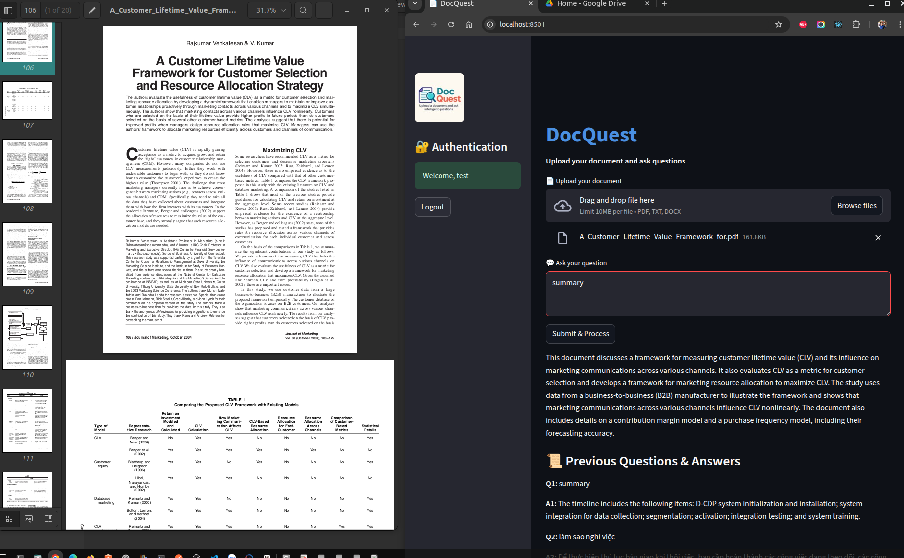

# Document-QA-System 📄🤖

 [](https://github.com/trieu/Document-QA-System/releases)

**Document-QA-System** is a Streamlit-powered application that lets you ask questions directly about the content of uploaded documents. It combines **Gemini embeddings** with a **language model** to deliver fast, context-aware answers. The app supports multiple document formats, including **PDF, TXT, and DOCX**.



---

## 📑 Table of Contents

1. [Features](#features)
2. [Technologies Used](#technologies-used)
3. [Installation](#installation)
4. [Usage](#usage)
5. [Contributing](#contributing)
6. [License](#license)
7. [Contact](#contact)

---

## 🚀 Features

* **Multi-Format Support** → Upload PDF, TXT, or DOCX files.
* **Fast & Accurate** → Answers powered by embeddings + LLM.
* **Streamlit UI** → Clean, interactive, and intuitive interface.
* **Interactive QA** → Ask natural language questions, get relevant responses.
* **Scalable Performance** → Handles documents of varying sizes and complexity.

---

## 🛠️ Technologies Used

* **[Streamlit](https://streamlit.io/)** → Web UI framework in Python.
* **[Streamlit-Authenticator](https://github.com/mkhorasani/Streamlit-Authenticator)** → Secure authentication for Streamlit apps.
* **[Google Gemini API](https://aistudio.google.com/)** → LLM-powered text generation, embeddings, and retrieval.
* **[LlamaIndex](https://www.llamaindex.ai/)** → Framework for building retrieval-augmented generation (RAG) pipelines.
* **[LlamaIndex + Gemini](https://www.llamaindex.ai/)** → Gemini LLM & embeddings integrated via LlamaIndex connectors.
* **[PostgreSQL Vector Store](https://www.postgresql.org/)** → Scalable vector database integration with `llama-index-vector-stores-postgres`.
* **[PyPDF](https://pypi.org/project/pypdf/)** & **[PyMuPDF](https://pymupdf.readthedocs.io/)** → PDF text and metadata extraction.
* **[python-docx](https://python-docx.readthedocs.io/)** → Parsing and processing Microsoft Word documents.
* **[python-dotenv](https://pypi.org/project/python-dotenv/)** → Environment variable management.
* **[bcrypt](https://pypi.org/project/bcrypt/)** → Secure password hashing.
* **[bleach](https://bleach.readthedocs.io/)** → HTML sanitization for safe text rendering.
* **[IPython](https://ipython.org/)** → Interactive Python development environment.
* **Python** → Core development language for orchestration and integration.

---

## ⚙️ Installation

Follow these steps to set up locally:

1. **Clone the Repository**

   ```bash
   git clone https://github.com/trieu/Document-QA-System
   cd Document-QA-System
   ```

2. **Set Environment Variable**
   Create a `.env` file and add your Google API key:

   ```bash
   nano .env
   ```

   ```env
   GEMINI_MODEL_NAME=models/gemini-2.5-flash-lite
   EMBEDDING_MODEL_NAME=gemini-embedding-001
   CACHE_DIR=./cache/vector_index
   SQLITE_DB_FILE=./database/doc_qa_app.db

   GOOGLE_API_KEY=your_api_key_here
   ```

   Get your key here: [Google AI Studio](https://aistudio.google.com/apikey).

3. **Create Virtual Environment**

   ```bash
   python -m venv venv
   source venv/bin/activate
   ```

4. **Install Dependencies**

   ```bash
   pip install -r requirements.txt
   ```

5. **Run the Application**

   ```bash
   streamlit run StreamlitApp.py
   ```

   Then open [http://localhost:8501](http://localhost:8501) in your browser.

---

## 💡 Usage

1. **Upload a Document** → Choose PDF, TXT, or DOCX.
2. **Ask Questions** → Type your query in the text box.
3. **Get Answers** → The system retrieves and summarizes content in real time.

**Example Queries**:

* *“What is the main topic of this document?”*
* *“Summarize the key points.”*
* *“What conclusions are presented?”*

---

## 🤝 Contributing

We welcome contributions!

1. Fork the repository.
2. Create a feature branch.
3. Implement your changes.
4. Push to your fork.
5. Open a pull request.

---

## 📜 License

This project is licensed under the **MIT License**. See [LICENSE](LICENSE) for details.

